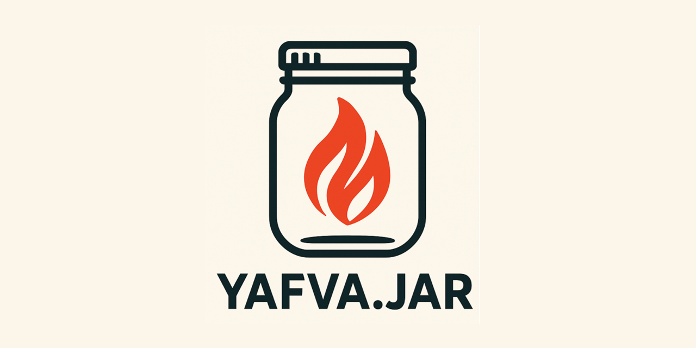

# YAFVA.JAR

## (Yet Another) FHIR VAlidator JAva wRapper
### Wrapped. Lit. Ready to validate.
---
Just another JAR. But faster.

YAFVA.JAR is a production-grade HTTP wrapper around the official HL7/HAPI FHIR Validator. It exposes the validation engine as a lightweight, high-performance HTTP service—built into a single JAR file you can drop into your infrastructure.

Unlike the official FHIR Validator Wrapper, this project is optimized for speed and reliability in persistent runtime environments. It avoids the overhead of loading FHIR packages from disk for every user session by maintaining a preloaded, memory-resident validation context, which can be cloned for multithreaded use.  
The client does not need to worry about user session initialization times, sesssion ID's or session TTL.

### ⚙️ Configuration Options
Configurations can be set using application.yaml or by passing command line arguments when calling the JAR:  
`java -jar yafva.jar --server.port=3500 --validator.tx-server= --validator.sv=4.0.1 --server.tomcat.threads.min-spare=9 --server.tomcat.threads.max=15 --validator.ig[0]=hl7.fhir.us.core#6.1.0`  
The above command will start the server using port 3500, FHIR version R4, with no terminology server, 9-15 concurrent threads and the package `hl7.fhir.us.core#6.1.0` in context.

This same configuration in `application.yaml` will look like this:
```
server:
  port: 3500
  tomcat:
    threads:
      min-spare: 9
      max: 15

validator:
  sv: '4.0.1'
  ig:
    - 'hl7.fhir.us.core#6.1.0'
  tx-server:
```

For detailed information about all available configuration options, see the [Configuration Reference](./docs/CONFIGURATION.md).

### ⚙️ Recommended server.tomcat.threads configuration
As a baseline it is recommended to start with:  
`min-spare`: ~0.75 * CPU's  
`max`: ~1.25 * CPU's  
For example, the configurations supplied above of 9-15 is for a 12-core machine.

---

## HTTP Endpoints
### GET / (Root)
Home page (HTML) with information about the deployed validator server.

### GET /swagger-ui/index.html
API documentation page (Swagger)

### /validate
Validate a single resource.  
*optional URL parameters*:
- profiles
- format

### /validateBundle
Validate a bath Bundle and recieve the results as a Bundle of OperationOutcomes.

---

## 📦 Installation Guides

- [Linux Installation](./docs/INSTALL-linux.md)
- [Windows Installation](./docs/INSTALL-windows.md)
- [Kubernetes Installation](./docs/INSTALL-kubernetes.md)
- [Configuration Reference](./docs/CONFIGURATION.md)

---

## 🛠️ Local development

The HL7 FHIR validator dependency comes from the
[Outburn-IL fork](https://github.com/Outburn-IL/org.hl7.fhir.core) of
`org.hl7.fhir.core`, published to GitHub Packages. Packages are private to
GitHub auth, so Maven needs a token with `read:packages` scope before it can
resolve `ca.uhn.hapi.fhir:org.hl7.fhir.validation`.

For local builds, that means a PAT is required unless the dependency is already
present in your local Maven cache. Building in GitHub Actions is different: the
workflow's `GITHUB_TOKEN` can read the package because it runs inside the same
organization with `packages: read` permission.

One-time setup (PowerShell, using the `gh` CLI):

```powershell
# 1. Grant gh the read:packages scope (opens a browser once)
gh auth refresh -h github.com -s read:packages

# 2. Make sure ~/.m2/settings.xml has a <server id="github-yafva"> entry
#    referencing ${env.GITHUB_PACKAGES_TOKEN} (see project docs).

# Example:
# <server>
#   <id>github-yafva</id>
#   <username>YOUR_GITHUB_USERNAME</username>
#   <password>${env.GITHUB_PACKAGES_TOKEN}</password>
# </server>

# 3. Per-shell: expose the token to Maven
$env:GITHUB_PACKAGES_TOKEN = gh auth token

# 4. Build
./mvnw clean package
```

To make it persistent across shells:

```powershell
setx GITHUB_PACKAGES_TOKEN (gh auth token)
```

Fork-bump procedure (when the validator dependency needs to follow upstream)
is documented in
[`hapifhir-validator/SYNC.md`](https://github.com/Outburn-IL/org.hl7.fhir.core/blob/master/SYNC.md).

---

## 🔍 License

This project is licensed under the **Apache License 2.0**.

### 📜 Dependencies & Their Licenses:

- **FHIR Validator (Apache 2.0)** - [HL7 FHIR Validator](https://github.com/hapifhir/org.hl7.fhir.validator-wrapper)

---